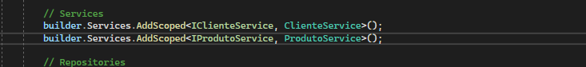

# DESAFIO - CADASTRO DE CLIENTES E PRODUTOS (BACK-END e FFRONT-END)

## O que foi feito ?

* Cadastro e listagem de clientes;
* Cadastro e listagem de produtos (com vínculo a cliente);
* Validação de CPF de cliente: ao cadastrar um CPF duplicado ou no formato errado, o back-end valida e lança uma exceção para o front-end capturar;
* Teste unitários de CPF;

# Para rodar o projeto, é preciso:
* rodar npm install no front para instalar dependências;
* rodar Update-Database no console do Visual Studio ou utilizar o dotnet-ef para criar as tabelas numa base de dados;

## Que mais seria poderia ser feito, para melhorias futuras no projeto:

* CRUD Completo. Por enquanto o projeto só tem o cadastro e a leitura;
* Modal para criar produtos e clientes (creio que poderia ser mais intuitivo e limpo do que um formulário acima da listagem);
* Detalhamento da quantidade de produtos que um cliente tem para si;
* Listagem de produtos por cliente;
* Paginação;

## Alguns padrões usados:

* Repository: criei classes para acesso a dados e operações de CRUD:

* DTO: criei classes de transferência de dados, para manter a integralidade das entidades salvas e fazer operações de salvamento e leitura apenas com os dados necessários para essas operações:

* Injeção de dependência: não estou precisando instanciar ou utilizar referências estáticas de repositórios ou serviços. Em vez disso, como no exemplo abaixo, registrei um serviço na classe Program e assim eu consigo acessar o serviço na aplicação por meio de sua interface:

